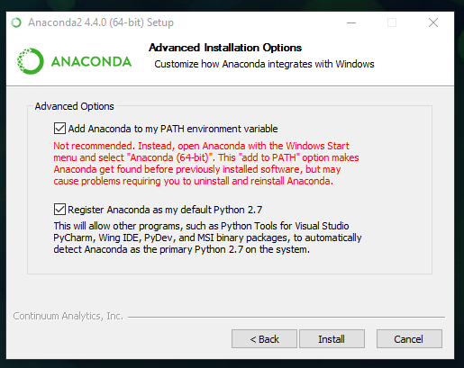

# QuantKit

## Table of Contents
<!-- TABLE OF CONTENTS -->
<details>
  <summary>Table of Contents</summary>
  <ol>
    <li>
      <a href="#description">About The Project</a>
      <ul>
        <li><a href="#built-with">Built With</a></li>
        <li><a href="#relevant-links">Relevant Links</a></li>
      </ul>
    </li>
    <li><a href="#support">Support</a></li>
    <li>
      <a href="#getting-started">Getting Started</a>
      <ul>
        <li><a href="#prerequisites">Prerequisites</a></li>
        <li><a href="#installation">Installation</a></li>
        <li><a href="#configarations">Configarations</a></li>
      </ul>
    </li>
    <li><a href="#usage">Usage</a></li>
    <li><a href="#roadmap">Roadmap</a></li>
    <li><a href="#contributing">Contributing</a></li>
    <li><a href="#authors-and-acknowledgment">Authors and Acknowledgement</a></li>
  </ol>
</details>

## About the Project
---
QuantKit is a powerful Python package designed to streamline the process of quantitative research and analysis by seamlessly integrating data operations and high-level calculations. This comprehensive toolkit empowers users to effortlessly pull data from diverse sources, including MSCI, Quandl, FRED, and Snowflake databases, using intuitive and easy-to-use functions. By combining data retrieval, transformation, and validation with sophisticated risk measurement and asset allocation capabilities, QuantKit provides a unified solution for quantitative researchers and data scientists. Whether you are a seasoned professional or a novice in the field, QuantKit is your go-to tool to expedite and enhance the quantitative research process.

### Built With
[![python][python]][python-url]

### Relevant Links
[![Git][git]][git-url]
[![Azure][ml-azure]][ml-azure-url]
[![Power Bi][power-bi]][power-bi-url]
[![Snowflake][snowflake]][snowflake-url]

<p align="right">(<a href="#quantkit">back to top</a>)</p>

## Support
---
- For further questions, please send an email to [tim.bastian@tcw.com](mailto:tim.bastian@tcw.com?cc=Sherveen.Abdarbashi@tcw.com&subject=quantkit)
- For feature recommendations or bug fixes, please open an [issue](https://gitlab.com/tcw-group/quant-research/quantkit/-/issues).
- For recent changes, please check the [CHANGELOG](CHANGELOG.md). <br>

<p align="right">(<a href="#quantkit">back to top</a>)</p>

## Getting Started 
---

### Local Environment
---

### Prerequisites
- IDE: The outlined procedures are executed within Visual Studio Code (VSC). While alternative Integrated Development Environments (IDEs) can also be employed, it is important to note that variations in the steps may be necessary.
- Install Anaconda: It is advisable, though not mandatory, to install Anaconda from [this link](https://conda.io/projects/conda/en/latest/user-guide/install/index.html). Ensure that you choose the appropriate version for your operating system. In the provided window, include Anaconda in your PATH environmental variable and complete the setup.

  
- Create Environment: Generate an environment specific to your project using Anaconda. Launch a command line and enter the following command. You may close the command line afterward.
```shell
> conda create -n "quantkit" python=3.10 ipython -y
```
- Git: A functional installation of Git on your computer is essential. If access to the [the quantkit folder](https://gitlab.com/tcw-group/quant-research/quantkit) on GitLab has not been granted, kindly request it.

### Installation
- Open VSC (or your preferred Integrated Development Environment - IDE)
- Activate Environment: Within Visual Studio Code (VSC), initiate a new window and open the folder where you intend to install QuantKit. Navigate to the top menu, select Terminal > New Terminal. Within the terminal, input the following command:
```shell
> conda activate quantkit
```
- Select Python Interpreter: Press CTRL+SHIFT+P on your keyboard to open a window from the top. Type "Python: Select Interpreter" and select it. From the options, choose your Conda QuantKit environment.
- Head to the GitLab folder of [QuantKit](https://gitlab.com/tcw-group/quant-research/quantkit) and clone the repository by selecting Clone > Clone with HTTPS > Copy URL
- In a terminal within Visual Studio Code (VSC), enter the following command:
```shell
> git clone copied_path_from_step_above
```
- This action clones the repository to your local machine. Activate the development branch by entering the following commands in the terminal:
```shell
> cd quantkit
> git checkout develop
```
- Install the requirements: In the terminal, input the following command, ensuring that the QuantKit environment is still activated.
```shell
> pip install -r requirements.txt
```
- ATTENTION: Kindly refrain from making modifications to the development branch and pushing them directly. If you wish to contribute and make changes to the code, please adhere to the guidelines outlined in the [CONTRIBUTING](CONTRIBUTING.md) document.

### Configarations
The configuration file encompasses all user-adjustable settings and is located in quantkit > configs > configs.json.

#### Local configs file

It is advisable to utilize a local configs.json file and refrain from overwriting parameters in the original file. To accomplish this, open Notepad on your machine, input `{}`, and save it as configs.json on your local system, located outside of the QuantKit folder. Reference the aforementioned configs file when executing the functions of QuantKit.


#### The configs file
The user has the flexibility to modify keys for API usage, thresholds for calculations, data sources, and more. Initially, ensure that the settings and paths in the original configs file are accurate. If adjustments are necessary, please make them in the local file you created in the previous step. For instance, to modify the `portfolio_datasource`, copy the relevant portion you wish to change into your local file.
The source enumeration operates according to the following scheme:
1. Excel
2. CSV
3. Snowflake
4. MSCI API
5. Quandl API
6. JSON
7. SQL-Server
8. FRED

Therefore, if you wish to alter the `portfolio_datasource` to Excel, input the following parameters into your local file:

```json
    "portfolio_datasource": {
        "source": 1,
        "file": "path/to/excel",
        "sheet_name": "Sheet_Name" ,
        "load": true 
    }
```

If you intend to make modifications solely to the `calanderdate` in the `fundamentals_datasource`, you can achieve this by adding the following to your configs file:

```json
    "quandl_datasource": {
        "filters": {
            "calendardate": {"gte": "2023-04-01"},
        }
    }
```

There is no necessity to duplicate all other settings for the datasource. Finally, if you intend to utilize the Snowflake API, it is mandatory to insert your credentials into your local configs file in the following manner:

```json
    "API_settings": {
        "snowflake_parameters": {
            "user": "your.email@tcw.com",
            "password": "your_password"
        }
    }
```

<p align="right">(<a href="#quantkit">back to top</a>)</p>

### ML Azure Environment
---
### Prerequisites
- ML Azure Access: Ensure that you have the necessary access to ML Azure and can successfully execute code within the platform.
### Installation
- Head to the GitLab folder of [QuantKit](https://gitlab.com/tcw-group/quant-research/quantkit) and clone the repository by selecting Clone > Clone with HTTPS > Copy URL
- In ML Azure, navigate to the folder where you want the QuantKit code to reside, right-click on the folder, and select "Open Terminal."
- In the terminal, enter the following command:
```shell
> git clone copied_path_from_step_above
```
- This action clones the repository to your machine. Activate the develop branch by typing the following commands into the terminal:
```shell
> cd quantkit
> git checkout develop
```
- You might encounter a request to add an exemption for this directory to execute the command above. Copy and execute the command provided in the error message, then rerun the `checkout` command afterward.
- Create a notebook within your top folder, situated on the same level as QuantKit.
- Select "Python 3.8 - ML Azure" as your default kernel in the right top corner.
- Install the requirements by typing the following command into a cell:
```shell
pip install -r "quantkit/requirements.txt"
```
- ATTENTION: Kindly refrain from making modifications to the development branch and pushing them directly. If you wish to contribute and make changes to the code, please adhere to the guidelines outlined in the [CONTRIBUTING](CONTRIBUTING.md) document.

### Configarations

Refer to the Configurations section in the Local Environment for further details.

<p align="right">(<a href="#quantkit">back to top</a>)</p>

## Update Version
---
As the frameworks evolve, changes to the code base are anticipated. To acquire the latest version of the code, you must pull from the GitLab repository.

### Local Environment
- In Visual Studio Code (VSC), open a Terminal from your working folder and execute the following commands:
```shell
> cd quantkit
> git pull
```

### ML Azure Environment
- In ML Azure, open a Terminal from your working folder and execute the following commands:
```shell
> cd quantkit
> git pull
```
- You will be prompted to enter your User Name and Password for your Git account linked to GitLab.

## Usage
---
The QuantKit package provides user-friendly functions in the `handyman` folder for executing crucial functionalities such as API usage.

### FRED API

```python

import quantkit.handyman.fred_data_loader as fred_data_loader 
fred_data_loader.run_fred_api(["CPILFESL"])

```

### MSCI API

```python

import quantkit.handyman.msci_data_loader as msci_data_loader 

factor_name_list = [
    "ISSUER_NAME", 
    "ISSUER_TICKER", 
    "ISSUER_CUSIP", 
    "ISSUER_SEDOL", 
    "ISSUER_ISIN", 
    "ISSUER_CNTRY_DOMICILE",
    "IVA_COMPANY_RATING",
]

msci_data_loader.run_msci_api("ISIN", ["US88160R1014", "US0378331005"], factor_name_list=factor_name_list)

```

### Quandl API

#### Fundamental Data

```python

import quantkit.handyman.quandl_data_loader as quandl_data_loader     

quandl_data_loader.get_quandl_fundamental_data(
    ["AAPL", "TSLA"],
    start_date="2018-01-01",
    end_date="2023-01-01"    
)

```

#### Price Data

```python

import quantkit.handyman.quandl_data_loader as quandl_data_loader     

quandl_data_loader.get_quandl_price_data(
    ["AAPL", "TSLA"],
    start_date="2018-01-01",
    end_date="2023-01-01"    
)

```

### Historical Portfolio Holdings

Ensure that you incorporate Snowflake credentials into your local configs file.

```python

import quantkit.handyman.portfolios as portfolios     

local_configs = "path\\to\\your\\local\\configs.json"

portfolios.historical_portfolio_holdings(
    start_date="01/31/2018",
    end_date="01/01/2023",
    portfolios=["3750"],
    equity_benchmark=["S & P 500 INDEX"],
    fixed_income_benchmark=["BB HIGH YIELD 2% CAP"],
    local_configs=local_configs,
)

```

### Snowflake API

The `snowflake_utils` folder facilitates easy data retrieval from Snowflake and data submission to Snowflake. Users can interact with the API in two ways: by crafting a query or by pulling all data from a table in a schema.

#### Pulling All Data from Table

```python

import quantkit.utils.snowflake_utils as snowflake_utils

local_configs = "path\\to\\your\\local\\configs.json"

snowflake_utils.load_from_snowflake(
        database="SANDBOX_ESG",
        schema="ESG_SCORES_THEMES",
        table_name="Sustainability_Framework_Detailed",
        local_configs=local_configs,
)

```

#### Pulling Data using Query

```python

import quantkit.utils.snowflake_utils as snowflake_utils

local_configs = "path\\to\\your\\local\\configs.json"
query = """
SELECT "Portfolio ISIN", "Security ISIN", "ESRM Score", "Transition Score", "Governance Score"
FROM SANDBOX_ESG.ESG_SCORES_THEMES."Sustainability_Framework_Detailed"
WHERE "Portfolio ISIN" = 'S&P 500 INDEX'
"""

snowflake_utils.load_from_snowflake(
        query=query,
        local_configs=local_configs,
)

```

#### Writing Data to Snowflake

```python

import quantkit.utils.snowflake_utils as snowflake_utils

local_configs = "path\\to\\your\\local\\configs.json"

snowflake_utils.write_to_snowflake(
    df,
    database,
    schema,
    table_name,
    local_configs = local_configs,
)

```

### Project Specific Functionality

Explore the following links for additional information on various use cases:
- [Risk Framework](documentations/RISKFRAMEWORK.md)
- [Asset Allocation]()
- [PAI](documentations/PAI.md)

<p align="right">(<a href="#quantkit">back to top</a>)</p>

## Roadmap
---
- [ ] add functionality to handyman folder


Refer to the [open issues](https://gitlab.com/tcw-group/quant-research/quantkit/-/issues) for a comprehensive list of proposed features and known issues.

<p align="right">(<a href="#quantkit">back to top</a>)</p>

## Contributing
---
For contributing guidelines, please review [CONTRIBUTING](CONTRIBUTING.md).

<p align="right">(<a href="#quantkit">back to top</a>)</p>

## Authors and acknowledgment
---
The risk framework is a collective effort of the Sustainable Investment Group (SIG). For further questions, please contact [ESGAnalysts@tcw.com](mailto:ESGAnalysts@tcw.com).

<p align="right">(<a href="#quantkit">back to top</a>)</p>

<!-- MARKDOWN LINKS & IMAGES -->
<!-- https://www.markdownguide.org/basic-syntax/#reference-style-links -->
[python]: https://img.shields.io/badge/python-3670A0?style=for-the-badge&logo=python&logoColor=ffdd54
[python-url]: https://www.python.org/
[git]: https://img.shields.io/badge/git-%23F05033.svg?style=for-the-badge&logo=git&logoColor=white
[git-url]: https://gitlab.com/tcw-group/quant-research/quantkit/-/tree/develop?ref_type=heads
[ml-azure]: https://img.shields.io/badge/ml%20azure-%230072C6.svg?style=for-the-badge&logo=microsoftazure&logoColor=white
[ml-azure-url]: https://ml.azure.com/fileexplorerAzNB?wsid=/subscriptions/9e6414f9-fa32-459d-87f7-26856c9ebc31/resourceGroups/rg-sub-ae-shared-dev-001-esgmlws/providers/Microsoft.MachineLearningServices/workspaces/mlw-sub-ae-shared-dev-001-esgmlws&tid=b730b432-2098-413f-bd4a-014acdf7c72e&activeFilePath=Users/Tim.Bastian/quantkit/test.ipynb
[power-bi]:https://img.shields.io/badge/power_bi-F2C811?style=for-the-badge&logo=powerbi&logoColor=black
[power-bi-url]: https://app.powerbi.com/groups/b47086b3-af81-40ba-901c-19e60543ea94/list?experience=power-bi
[snowflake]: https://img.shields.io/badge/Snowflake-22ADF6?style=for-the-badge&logo=InfluxDB&logoColor=white
[snowflake-url]: https://app.snowflake.com/tcw/titan/#/data/databases/ESG_SANDBOX/schemas/ESG