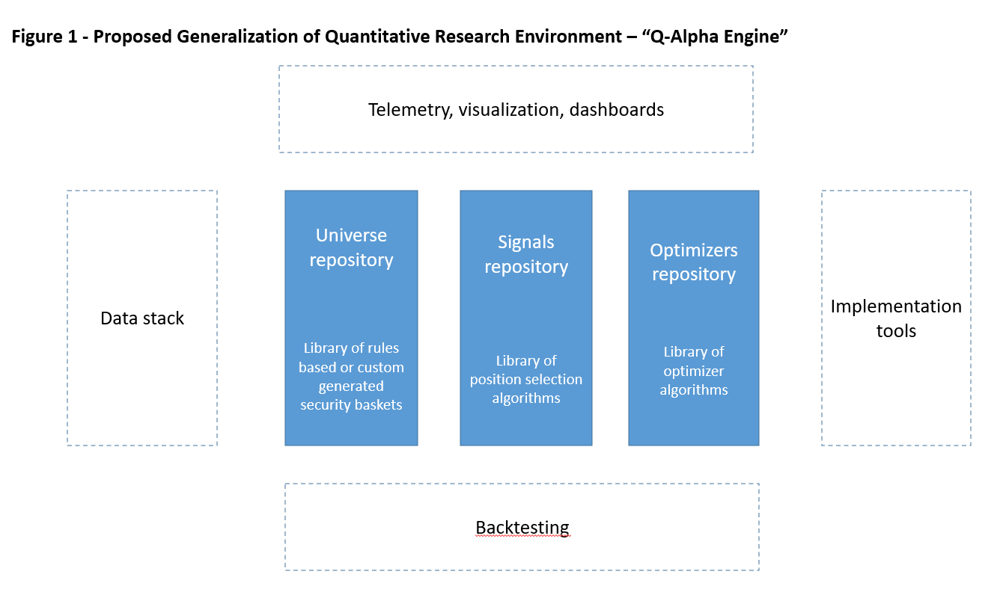

# Asset Allocation
The Asset Allocation package in QuantKit is a comprehensive tool designed to streamline your investment process. This powerful tool integrates various data sources, supports flexible security universes, and offers a diverse range of strategies through a well-organized signals repository. Utilizing advanced portfolio optimization techniques such as Mean Variance Optimization and Risk Parity, our package empowers users to make informed decisions while benefiting from advanced backtesting capabilities. Get ready to elevate your investment strategy with this versatile and user-friendly asset allocation solution.

  

## Settings
---
QuantKit users have the flexibility to employ and execute the package in two distinct ways. For additional details, refer to this [demo notebook](https://ml.azure.com/fileexplorerAzNB?wsid=/subscriptions/9e6414f9-fa32-459d-87f7-26856c9ebc31/resourceGroups/rg-sub-ae-shared-dev-001-esgmlws/providers/Microsoft.MachineLearningServices/workspaces/mlw-sub-ae-shared-dev-001-esgmlws&tid=b730b432-2098-413f-bd4a-014acdf7c72e&activeFilePath=Users/Tim.Bastian/quantkit/asset_allocation.ipynb).

### Configs-File Set-Up
Before executing the Asset Allocation functionality, ensure proper configuration of your local configs file. Specify the following parameters:

- API-Settings: Set Snowflake parameters

```shell

    "API_settings": {
        "snowflake_parameters": {
            "user": "user_name",
            "password": "password"
        }
    }

```

### Datasources

The asset allocation tool employs a diverse range of data sources, significantly augmenting the integrated API library. By incorporating various financial and market data providers, the tool ensures users have access to comprehensive and up-to-date information, enabling them to make well-informed investment decisions. 

- Fundamental Data: Quandl
- Price Data: Quandl
- Economic Data: FRED
- Holdings Data: Internal Snowflake
- Security Data: MSCI
- ESG Data: MSCI

<details>
  <summary><b>For Nerds</b></summary>
The developer can switch in and out datasources in the configs file. The data is loaded through the iter function in the runner.

```python

    def iter(self) -> None:
        """
        iterate over DataFrames and create connected objects
        """
        self.iter_parent_issuers()
        self.iter_portfolios()
        self.iter_msci()
        self.iter_prices()
        self.iter_fundamentals()
        self.iter_holdings()
        self.iter_securities()
        self.iter_cash()
        self.iter_companies()
        self.iter_sovereigns()
        self.iter_securitized()
        self.iter_muni()
        self.init_strategies()

```

To change the datasource, make the following changes in your configs file as advised in the configs section of the general README.

```shell

    "prices_datasource": {
        "source": 3,
        "table_name": "PRICES",
        "database": "SANDBOX_ESG",
        "schema": "QUANT_RESEARCH",
        "load": true
    },
    "fundamentals_datasource": {
        "source": 3,
        "table_name": "FUNDAMENTAL_DATA",
        "database": "SANDBOX_ESG",
        "schema": "QUANT_RESEARCH",
        "load": true
    },

```

</details>

### Universe
The initial step involves defining a suitable trading universe of securities. Users have a multitude of options to customize this universe by incorporating diverse settings within the configuration file. Furthermore, users can establish a start and end date for the trading universe, ensuring a tailored and targeted investment experience.

- Backtesting Timeframe: Define the months for which universe data should be retrieved.

```shell

    "universe_datasource": {
        "start_date": "01/01/2018",
        "end_date": "11/20/2023"
    }

```

- TCW Portfolios, optional: For TCW Portfolios, specify the portfolios on which the asset allocation framework should be executed on. Defaults to []. If the user wishes to run it on all available TCW portfolios, enter ["all"], and if the user wants to exclude all available TCW portfolios, enter an empty list [].

```shell

    "universe_datasource": {
        "tcw_universe": [""]
    }

```

- Equity Benchmark, optional: The user designates the equity benchmark indices on which the framework should be executed. Defaults to "S & P 500 INDEX". If the user wants to exclude all available benchmark portfolios, enter []. The following equity indices are currently available for selection as a universe:

    - "S & P 500 INDEX"
    - "S&P 500 EX TOBACCO"  
    - "Russell 1000"
    - "RUSSELL 1000 GROWTH" 
    - "RUSSELL 1000 VALUE"
    - "RUSSELL MIDCAP"
    - "RUSSELL 2000" 
    - "RUSSELL 2000 VALUE"
    - "RUSSELL 3000 GROWTH INDEX" 
    - "RUSSELL 3000 INDEX" 

```shell

    "universe_datasource": {
        "equity_universe": ["Russell 1000"]
    }  

```

- Fixed Income Benchmark, optional: The user designates the fixed income benchmark indices on which the framework should be executed. Defaults to []. If the user wants to exclude all available benchmark portfolios, enter [].

```shell

    "universe_datasource": {
        "fixed_income_universe": []
    }

```

- Custom Universe, optional: Users can define their own universe by inputting security ISINs. Defaults to [].

```shell

    "universe_datasource": {
        "custom_universe": ["US0378331005", "US5949181045", "US0231351067", 
                            "US30303M1027", "US46625H1005", "US0846707026",
                            "US02079K1079", "US02079K3059", "US4781601046",
                            "US30231G1022"]
    }

```

- Sustainable Universe, optional: Users have the choice to narrow down the universe to TCW's sustainable universe by incorporating blue and green tagged securities. Defaults to `false`.

```shell

    "universe_datasource": {
        "sustainable": false
    }

```

<details>
  <summary><b>For Nerds</b></summary>
The developer can find the code in quantkit > asset_allocation > universe. <br>
Upon initialization, a universe dataframe (r.portfolio_datasource.universe_df) is generated, indicating whether the security is held in the universe for a specified date. In the case of the custom universe, we assume a consistent universe over time.

| As Of Date | AAPL | MSFT | XOM | META | JNJ | BRK.B | AMZN | JPM | GOOGL |
:------------|:-----|:-----|:----|:-----|:----|:------|:-----|:----|:------|
2018-01-31 00:00:00 | True | True | True | True | True | True | True | True | True |
2018-02-28 00:00:00 | True | True | True | True | True | True | True | True | True |
2018-03-31 00:00:00 | True | True | True | True | True | True | True | True | True |

When iterating over the trading dates, the `outgoing_row` function in the `universe` package yields the corresponding universe for that date. It achieves this by maintaining the current universe and updating it when the date reaches the next specified universe date.

```python

def outgoing_row(self, date: datetime.date) -> np.ndarray:
    """
    Return current consitutents of index universe

    Parameters
    ----------
    date: datetimte.date
        date

    Returns
    -------
    np.array
        current constitutents of universe
    """
    if date >= self.universe_dates[self.current_loc + 1]:
        self.current_loc += 1
    return self.universe_matrix[self.current_loc]

```
</details>


### Strategies

The development of strategies and signal generation is crucial for every asset allocation tool. These components play a vital role in guiding investment decisions and optimizing portfolio performance. By incorporating a diverse range of strategies and robust signal generation mechanisms, an asset allocation tool can empower users to make well-informed decisions and achieve their financial objectives. The quantkit asset allocation tool currently is limited to the following strategies. The parameters for the strategies can be set in the `strategies` section of the configs file.

<details>
  <summary><b>For Nerds</b></summary>

Every strategy needs the following functions:

- A function called `assign` that is responsible for allocating historical returns to return-, risk-, and portfolio engine.
```python

    def assign(
        self,
        date: datetime.date,
        price_return: np.ndarray,
        annualize_factor: int = 1.0,
    ) -> None:
        """
        Transform and assign returns to the actual calculator

        Parameters
        ----------
        date: datetime.date
            date of snapshot
        price_return: np.array
            zero base price return of universe
        annualize_factor: int, optional
            factor depending on data frequency
        """

```

A `selected_securities` function that returns an array containing the indices of all selected securities for a specific strategy and date. Developers must ensure that no securities with missing return data are included in the selection.

```python

    @property
    def selected_securities(self) -> np.ndarray:
        """
        Index (position in universe_tickers as integer) of selected securities

        Returns
        -------
        np.array
            array of indexes
        """

```

A `return_metrics_optimizer` function that forecasts the returns for that particular strategy.

```python

    @property
    def return_metrics_optimizer(self) -> np.ndarray:
        """
        Forecaseted returns for selected securities

        Returns
        -------
        np.array
            returns
        """

```


</details>

#### Momentum

The momentum strategy adheres to the principle of "Buy Low, Sell High." This approach selects the `top_n` securities within a rolling window of `window_size`, based on their cumulative returns. If the user prefers to use different window sizes for the risk and return engines, they should specify `risk_window_size` and `return_window_size` rather than `window_size`. By identifying and capitalizing on these high-performing assets, the momentum strategy aims to optimize investment outcomes and generate consistent returns.

```shell

    "strategies": {
        "momentum90": {
            "type": "momentum",
            "stop_loss": null,
            "stop_loss_threshold": 0.0,
            "risk_window_size": 63,
            "return_window_size": 63,
            "portfolio_leverage": 1,
            "return_engine": "cumprod",
            "risk_engine": "log_normal",
            "top_n": 50,
            "allocation_models": [
                "equal_weight", 
                "market_weight", 
                "min_variance", 
                "constrained_min_variance", 
                "mean_variance", 
                "constrained_mean_variance", 
                "risk_parity",
                "hrp",
                "constrained_hrp"
            ]
        }
    }

```

<details>
  <summary><b>For Nerds</b></summary>

Momentum selects the `top_n` securities based on cumulative returns. We are sorting the return array by negative returns, which puts the highest return on top. We then pick the `top_n` securities, as long as they don't have missing data and they belong to the defined universe for that date. 

```python

    @property
    def selected_securities(self) -> np.ndarray:
        """
        Index (position in universe_tickers as integer) of top n momentum securities

        Returns
        -------
        np.array
            array of indexes
        """
        (tradeable,) = np.where((self.index_comp > 0) & (~np.isnan(self.latest_return)))
        neg_sort = tradeable[np.argsort(-self.return_metrics_intuitive[tradeable])]
        return neg_sort[: self.top_n]

```


</details>

#### Mean Reversion

The Mean Reversion strategy is predicated on the concept that significant price movements over a short duration are typically followed by a reversal in the subsequent period. This approach operates on the assumption that assets which have experienced sharp increases or decreases in value are likely to return to their average or 'mean' price level. This approach selects the choosen `decile` securities within a rolling window of `window_size`, based on their cumulative returns. If the user prefers to use different window sizes for the risk and return engines, they should specify `risk_window_size` and `return_window_size` rather than `window_size`.  Investors leveraging this strategy will look for opportunities to capitalize on this anticipated price correction, often by taking positions that are opposite to the recent market trend.

```shell

    "strategies": {
        "mean_reversion": {
            "type": "mean_reversion",
            "stop_loss": null,
            "stop_loss_threshold": 0.0,
            "risk_window_size": 63,
            "return_window_size": 21,
            "portfolio_leverage": 1,
            "return_engine": "cumprod",
            "risk_engine": "log_normal",
            "decile": 10,
            "fraud_threshold": 0.8,
            "allocation_models": [
                "equal_weight", 
                "market_weight", 
                "min_variance", 
                "constrained_min_variance", 
                "mean_variance", 
                "constrained_mean_variance", 
                "risk_parity",
                "hrp",
                "constrained_hrp"
            ]
        }
    }

```

<details>
  <summary><b>For Nerds</b></summary>

Mean Reversion selects the `decile` securities based on cumulative returns. We are sorting the return array by  returns, which puts the lowest return on top. We then pick the `top_n` securities, as long as they don't have missing data and they belong to the defined universe for that date. 

```python

    @property
    def selected_securities(self) -> np.ndarray:
        """
        Index (position in universe_tickers as integer) of top mean reversion securities

        Returns
        -------
        np.array
            array of indexes
        """
        (tradeable,) = np.where(
            (self.index_comp > 0)
            & (~np.isnan(self.latest_return))
            & (self.return_engine.return_metrics_optimizer > -self.fraud_threshold)
        )
        neg_sort = tradeable[np.argsort(self.return_metrics_intuitive[tradeable])]

        lower_bound = round(len(tradeable) / 10 * (self.decile - 1))
        upper_bound = round(len(tradeable) / 10 * self.decile)
        return neg_sort[lower_bound:upper_bound]

```


</details>

#### Relative Value

The Relative Value strategy aims to identify value stocks by filtering the investment universe based on fundamental measures and multiples in comparison to the index. This approach seeks to uncover undervalued assets with strong potential for growth, enabling investors to capitalize on market inefficiencies and generate favorable returns.


```shell

    "strategies": {
        "relative_value": {
            "type": "relative_value",
            "stop_loss": "high_low",
            "stop_loss_threshold": 0.1,
            "market_cap_threshold": 1000000000,
            "div_yield_threshold": 0.0,
            "roe_threshold": 0.17,
            "freecashflow_threshold": 0.0,
            "portfolio_leverage": 1,
            "window_size": 63,
            "return_engine": "log_normal",
            "risk_engine": "log_normal",
            "allocation_models": ["equal_weight", "market_weight"]
        }
    }

```

<details>
  <summary><b>For Nerds</b></summary>

Relative value filters the investment universe using measures such as market cap thresholds, dividend thresholds, and free cash flow thresholds, as defined in the configuration file.

```python

    @property
    def selected_securities(self) -> np.ndarray:
        """
        Index (position in universe_tickers as integer) of selected securities

        Returns
        -------
        np.array
            array of indexes
        """
        ss = np.arange(self.num_total_assets)
        return ss[
            ~np.isnan(self.latest_return)
            & self.index_comp
            & (self.market_caps > self.market_cap_threshold)
            & (self.divyield > self.div_yield_threshold)
            & (self.roe > self.roe_threshold)
            & (self.fcfps > self.freecashflow_threshold)
        ]

```


</details>

#### Magic Formula
The Magic Formula employs several fundamental filters to refine the selection of securities. It ranks the universe by Return on Invested Capital (ROIC) in descending order and by Enterprise Value to Earnings Before Interest and Taxes (EV/EBIT) in ascending order. The strategy then selects the top `n` securities based on the aggregate score.


```shell

    "strategies": {
        "magic_formula": {
            "type": "magic_formula",
            "top_n": 30,
            "stop_loss": null,
            "stop_loss_threshold": 0.15,
            "window_size": 63,
            "portfolio_leverage": 1,
            "return_engine": "log_normal",
            "risk_engine": "log_normal",
            "allocation_models": [
                "equal_weight", 
                "market_weight", 
                "min_variance", 
                "constrained_min_variance", 
                "mean_variance", 
                "constrained_mean_variance", 
                "risk_parity",
                "hrp",
                "constrained_hrp"
            ]
        }
    }

```

<details>
  <summary><b>For Nerds</b></summary>

```python

    @property
    def selected_securities(self) -> np.ndarray:
        """
        Index (position in universe_tickers as integer) of selected securities

        Returns
        -------
        np.array
            array of indexes
        """
        nan_sum = np.isnan(self.latest_return).sum()
        top_n = min(self.top_n, self.num_total_assets - nan_sum)

        roic_order = (-self.roic).argsort()
        roic_rank = roic_order.argsort()
        evebit_order = (self.evebit).argsort()
        evebit_rank = evebit_order.argsort()
        total_rank = evebit_rank + roic_rank
        sort = total_rank.argsort()

        selected_assets = 0
        i = 0
        a = list()

        while selected_assets < top_n and i < self.num_total_assets:
            if self.index_comp[sort[i]] > 0:
                a.append(sort[i])
                selected_assets += 1
            i += 1
        return np.array(a)

```


</details>

#### Pick All

The strategy straightforwardly selects all available securities within the investment universe, providing a comprehensive approach to asset allocation and ensuring that no potential opportunities are overlooked.

```shell

    "strategies": {
        "pick_all": {
            "type": "pick_all",
            "stop_loss": null,
            "stop_loss_threshold": 0.0,
            "window_size": 63,
            "portfolio_leverage": 1,
            "return_engine": "log_normal",
            "risk_engine": "log_normal",
            "allocation_models": ["equal_weight", "market_weight", "original_weight"]
        }
    }

```

<details>
  <summary><b>For Nerds</b></summary>

The strategy picks all securities available for that month without missing data.

```python

    @property
    def selected_securities(self) -> np.ndarray:
        """
        Index (position in universe_tickers as integer) of selected securities

        Returns
        -------
        np.array
            array of indexes
        """
        ss = np.arange(self.num_total_assets)
        return ss[~np.isnan(self.latest_return) & self.index_comp]

```


</details>

### Return and Risk Calculation

For strategy development, accurately forecasting risk and returns is crucial to ensure optimal investment decisions and portfolio performance. The asset allocation tool offers several options to achieve this. Understanding risk and return dynamics is essential because it enables investors to identify potential opportunities, manage risk exposure, and allocate assets effectively, ultimately leading to more informed decisions and improved financial outcomes.

The asset allocation tool employs an online algorithm implementation for both risk and return calculations. This means that the mean and variance are updated with every incoming data point. This dynamic approach allows the tool to continuously adapt to new information effectively, ensuring that the most recent market trends and data are taken into account when making investment decisions.

#### Simple Mean/ Covariance

First, one option is to use simple historical mean returns to forecast future returns. This approach is appealing due to its simplicity and ease of implementation. By relying on historical data, investors can gain insights into past performance trends and make informed decisions. However, this method may not always be the most accurate predictor of future returns, as it assumes that past performance is indicative of future results, which may not always hold true. Market conditions and other factors can change, potentially leading to deviations from historical patterns. 

To utilize the simple mean in your strategy, configure the engines by setting them to `simple`.

```shell

    "strategies": {
        "xxx": {
            "type": "xxx",
            "return_engine": "simple",
            "risk_engine": "simple"
        }
    }

```

<details>
  <summary><b>For Nerds</b></summary>

The simple mean online algorithm operates as follows:


The simple covariance online algorithm operates as follows:

*(x_t-\overline{x_{t}}))

</details>

#### Logarithmic Mean/ Covariance

Another option is to use logarithmic historical mean returns to forecast returns into the future. This approach is based on the idea that the logarithm of returns follows a normal distribution. Instead of using the entire history, this method employs a rolling window to capture more recent trends. 

To utilize the logarithmic mean and risk in your strategy, configure the engines by setting them to `log_normal`.

```shell

    "strategies": {
        "xxx": {
            "type": "xxx",
            "return_engine": "log_normal",
            "risk_engine": "log_normal"
        }
    }

```

#### Exponentially Weighted Mean/ Covariance

Next, the tool allows using exponential weighted logarithmic historical mean returns to forecast returns into the future, both rolling and on full history. This approach assigns greater importance to more recent data points, allowing the model to adapt more quickly to changing market conditions. The advantage of this method is that it can provide a more responsive and accurate representation of current trends, potentially leading to better investment decisions. However, the downside is that it may be more sensitive to short-term fluctuations and could overlook longer-term trends. As with any forecasting method, it is essential to consider the specific investment objectives and risk tolerance when choosing the most appropriate approach.

To utilize the exponential mean and risk in your strategy, configure the engines by setting them to `ewma` or `ewma_rolling`.

```shell

    "strategies": {
        "xxx": {
            "type": "xxx",
            "half_life": 12,
            "return_engine": "ewma",
            "risk_engine": "ewma"
        }
    }

```

```shell

    "strategies": {
        "xxx": {
            "type": "xxx",
            "span": 36,
            "return_engine": "ewma_rolling",
            "risk_engine": "ewma_rolling"
        }
    }

```

<details>
  <summary><b>For Nerds</b></summary>

There is an adjusted and unadjusted version of exponential mean calculation.
[See here chapter 9](https://fanf2.user.srcf.net/hermes/doc/antiforgery/stats.pdf) and [here](https://pandas.pydata.org/docs/reference/api/pandas.DataFrame.ewm.html) for more details..

</details>

#### Cumulative Returns

Another option is to use cumulative historical returns to forecast returns into the future. This approach considers the total returns over a specified period, providing a comprehensive view of an asset's performance. The advantage of this method is that it captures the overall growth or decline of an asset, potentially offering a more stable basis for forecasting. However, the downside is that it may not be as responsive to short-term fluctuations and could overlook more recent trends that may impact future performance. 
To utilize the exponential mean and risk in your strategy, configure the engines by setting them to `cumprod`.

```shell

    "strategies": {
        "xxx": {
            "type": "xxx",
            "window_size": 63,
            "return_engine": "cumprod"
        }
    }

```

### Risk Management

Risk management plays a pivotal role in strategy development. The asset allocation tool accommodates several stop-loss methods to effectively manage risk. These methods provide a safety net, limiting potential losses and ensuring that investment strategies align with the user's risk tolerance. By incorporating these stop-loss methods, the tool enhances the robustness of the investment process and helps users navigate volatile market conditions with confidence.

#### No Stop-Loss

If the user prefers not to implement any stop-loss thresholds, they can set the `stop_loss` parameter to `null`.

```shell

    "strategies": {
        "xxx": {
            "type": "xxx",
            "stop_loss": null,
            "stop_loss_threshold": 0.0
        }
    }

```

#### Buy To Low

Firstly, users have the option to implement a Buy-To-Low strategy. This approach compares the purchase price at the rebalance date against a predetermined threshold value percentage. If the current price falls below this threshold, the strategy triggers a sell order for that security, converting it to cash. The cash is then held until the next rebalance.

To utilize this risk management approach, configure the `stop_loss` and `stop_loss_threshold` parameters within the strategy settings. 

```shell

    "strategies": {
        "xxx": {
            "type": "xxx",
            "stop_loss": "buy_low",
            "stop_loss_threshold": 0.1
        }
    }

```


#### High To Low

Secondly, users can implement a High-To-Low strategy. This approach monitors the highest price since purchasing the security at the rebalance date and compares it against a predetermined threshold value percentage. If the current price falls below this threshold, the strategy triggers a sell order for that security, converting it to cash. The cash is then held until the next rebalance, providing a proactive approach to risk management and protecting against further potential losses.

To utilize this risk management approach, configure the `stop_loss` and `stop_loss_threshold` parameters within the strategy settings. 

```shell

    "strategies": {
        "xxx": {
            "type": "xxx",
            "stop_loss": "high_low",
             "stop_loss_threshold": 0.1
        }
    }

```

#### Holding Limit for assets

The user can impose an upper limit on asset classes deemed risky and then distribute the excess weight either equally by setting `allocate_to` to 'equal' or by specifying a list that reflects descending importance.

```shell

    "allocation_limit": {
        "limited_assets": ["SP500", "Nasdaq", "REITs", "Commodities", "Gold"],
        "limit": 0.35,
        "allocate_to": ["MBSIdx", "Treasuries"]
    }

```

### Optimizers

Once a universe has been selected, the asset allocation tool offers various portfolio optimization options through different weighting strategies. These strategies include equal weight, market weight, original weight,mean variance optimization, minimum variance, and risk parity. Each approach has its unique advantages and considerations, allowing users to tailor their portfolio construction to align with their specific investment objectives and risk tolerance.

Begin by establishing weight constraints for constrained strategies, ensuring that the portfolio optimization process adheres to the desired risk and allocation parameters.

- Weight Constraints, optional: The allowable range of weights that an asset can take on in constrained weighting strategies at any point in time. The `weight_constraints` dictionary allows users to apply weight constraints to individual assets by specifying the asset's ticker and a list of constraints for that asset.

```shell

    "default_weights_constraint": [0.001, 0.15],
    "weight_constraint": {
        "AAPL": [0.01, 0.05],
        "MSFT": [0.02, 0.03]
    }

```

To utilize the various weighting strategies, assign them within the `allocation_models` section of your configuration file.

```shell

    "strategies": {
        "xxx": {
            "allocation_models": [
                "equal_weight", 
                "market_weight", 
                "original_weight",
                "min_variance", 
                "constrained_min_variance", 
                "mean_variance", 
                "constrained_mean_variance", 
                "risk_parity",
                "hrp",
                "constrained_hrp"
                ]
        }
    }

```

<details>
  <summary><b>For Nerds</b></summary>

  

</details>

### Backtesting

After assigning the returns to the optimizers, the asset allocation package computes a portfolio return based on the chosen assets. This enables a rigorous backtesting capability, allowing users to thoroughly evaluate the performance of their investment strategies and make well-informed decisions.  First, the user can set the following parameters: 

- Rebalance Period: Can either be set to "DAY", "MONTH", "QUARTER",  "YEAR"

```shell

    "prices_datasource": {
        "rebalance": "MONTH"
    }

```
- Transaction Costs, optional: Transaction costs per trade refer to the expenses associated with each individual trade.

```shell

    "trans_cost": 0.01

```

The allocation tool then calculates daily portfolio returns based on current allocation and past allocation.

```python

            ex_ante_portfolio_return = self.get_portfolio_stats(
                ex_ante_allocation, ex_post_allocation
            )

```

<details>
  <summary><b>For Nerds</b></summary>

The returns are calculated in the following way. `this_returns` is an array of daily returns for all securities in the universe.

```python

    def get_portfolio_return(
        self,
        allocation: np.ndarray,
        this_returns: np.ndarray,
        stopped_securities_matrix: np.ndarray,
        indexes: np.ndarray,
        next_allocation: np.ndarray = None,
        trans_cost: float = 0.0,
        **kwargs,
    ) -> pd.DataFrame:
        """
        Calculate 0 basis portfolio return
        Return a DataFrame with returns in frequency for each date in rebalance window

        Parameters
        ----------
        allocation: np.array
            current allocation
        this_returns: np.array
            forecasted returns per asset
        stopped_securities_matrix: np.array
            matrix of stopped securities per trading period
        indexes: np.array
            index column for returned DataFrame
            should be set to date range
        next_allocation: np.array, optional
            next allocation, used to calculate turnover and transaction costs
        trans_cost: float, optional
            transaction cost in %

        Returns
        -------
        pd.DataFrame
            return: float
        """
        n_obs = len(this_returns)
        traded_m = np.bitwise_not(stopped_securities_matrix) 
        first_stop = (stopped_securities_matrix.cumsum(axis=0).cumsum(axis=0) == 1)  * trans_cost
        
        this_returns = this_returns * traded_m
        cumulative_returns = np.cumprod(this_returns + 1, axis=0)
        cumulative_returns = np.where(
            np.isnan(cumulative_returns), 0, cumulative_returns
        )
        ending_allocation = allocation * cumulative_returns
        # Normalize ending allocation
        ending_allocation = (
            ending_allocation.T / np.nansum(ending_allocation, axis=1)
        ).T
        stopped_ending = ending_allocation * traded_m

        actual_returns = allocation @ cumulative_returns.T
        actual_returns = np.insert(actual_returns, 0, 1)
        actual_returns = np.diff(actual_returns) / actual_returns[:-1]

        # Subtract transaction costs
        next_allocation_m = copy.deepcopy(ending_allocation)
        next_allocation_m[-1] = next_allocation
        trans_cost_m = np.zeros((n_obs, self.universe_size))
        trans_cost_m[-1] = trans_cost
        trans_cost_m = np.max([trans_cost_m, first_stop], axis=0)
        if next_allocation is not None:
            turnover = abs(next_allocation_m - stopped_ending)
            this_trans_cost = (turnover * trans_cost_m).sum(axis=1)
            actual_returns -= this_trans_cost

        return pd.DataFrame(data=actual_returns, index=indexes, columns=["return"])


```


</details>

## Usage

### The Object Method
Proficient users can leverage the structure of objects generated within the code. Begin by initializing a runner object using the following method.

```python

import quantkit.runners.runner_PAI as runner

local_configs = "path\\to\\your\\configs.json"

r = runner.Runner()
r.init(local_configs=local_configs)
r.run()

```

This establishes connections to all databases and executes the calculations. To retrieve datapoints, we can inspect the objects. We access a portfolio object in the following way.

```python

r.portfolio_datasource.portfolios["3750"].impact_data

```

### The handyman Folder

The `handyman` folder serves as a user-friendly option for those solely interested in the output rather than the objects. It offers functions to execute the PAI framework and obtain pertinent data without navigating through the objects. To run the PAI framework and obtain a detailed DataFrame, execute the `principal_adverse_impact()` function available in the `pai` package.

```python

import quantkit.handyman.pai as pai

local_configs = "path\\to\\your\\configs.json"

df = pai.principal_adverse_impact(local_configs)

```

To obtain the original data points for each security of each portfolio utilized in the calculation, execute the following function.

```python

import quantkit.handyman.pai as pai

local_configs = "path\\to\\your\\configs.json"

df = pai.principal_adverse_data_points(local_configs)

```