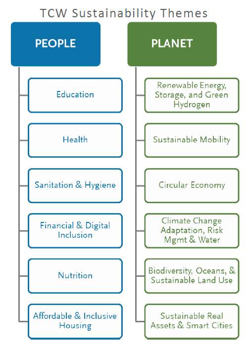

# Risk Framework

At TCW, we recognize that environmental, social, and corporate governance (ESG) factors can impact investment outcomes amid global changes, evolving regulations, consumer preferences, and workforce trends. Assessing the relevance of ESG factors to material risks and investment opportunities aligns not only with our fiduciary duty but also reinforces its fulfillment. Third-party data providers offer research frameworks to distinguish financially material ESG factors. However, these frameworks often lack standardization and comparability, with varied and ambiguous definitions of 'ESG.' The sustainability focus in investments has grown, yet debates persist on definitions and measurement methodologies for sustainable indicators. Navigating this dynamic landscape is a significant challenge that TCW, as a firm, is committed to addressing.

As a value-driven active manager, TCW adheres to a fundamental research-based investment philosophy, extending to sustainable investment. We've developed a proprietary research framework for quantifying ESG risks and sustainability. This framework includes quantified scoring across asset classes, breaking down our evaluation of a company's sustainable management into governance quality, environmental and social hazards, and climate transition risks. We also assess investments for alignment with 12 sustainability themes addressing challenges faced by the planet and its people.

  

## Usage
---
QuantKit users have the flexibility to employ and execute the package in two distinct ways. For additional details, refer to this [demo notebook](https://ml.azure.com/fileexplorerAzNB?wsid=/subscriptions/9e6414f9-fa32-459d-87f7-26856c9ebc31/resourceGroups/rg-sub-ae-shared-dev-001-esgmlws/providers/Microsoft.MachineLearningServices/workspaces/mlw-sub-ae-shared-dev-001-esgmlws&tid=b730b432-2098-413f-bd4a-014acdf7c72e&activeFilePath=Users/Tim.Bastian/quantkit/demo.ipynb).

### Configs-File Set-Up
Before executing the risk framework functionality, ensure proper configuration of your local configs file. Specify the following parameters:

- API-Settings: Set Snowflake parameters

```shell

    "API_settings": {
        "snowflake_parameters": {
            "user": "user_name",
            "password": "password"
        }
    }

```

- As Of Date, optional: Specifies the date on which the framework should be executed; defaults to the last business day.

```shell

    "as_of_date": "01/31/2023"

```

- Portfolios, optional: For Portfolios, specify the portfolios on which the risk framework should be executed on. Defaults to "701", "702", "703", "704", "705", "706", "707", "708", "709", "710", "711", "712", "713", "714", "3237", "3704", "3720", "3730", "3735", "3738", "3750", "3775", "3798", "4790", "6283", "6293", "6717", "6739", "6741", "6748", "6751", "6757", "6781", "6784", "13727", "13751", "16703", "16705", "16706", "16719", "16720", "3666", "3667", "3668", "3669", "6293", "3778", "3234", "3660", "3659". If the user wishes to run it on all available TCW portfolios, enter ["all"], and if the user wants to exclude all available TCW portfolios, enter an empty list [].

```shell

    "portfolios": ["all"]

```

- Equity Benchmark, optional: The user designates the equity benchmark indices on which the framework should be executed. Defaults to "JESG EMBI Global Diversified Index", "JPM CEMBI BROAD DIVERSE", "JPM EMBI GLOBAL DIVERSIFI", "MSCI WORLD", "Russell 1000", "RUSSELL 1000 GROWTH", "RUSSELL 1000 VALUE", "RUSSELL 3000 GROWTH INDEX", "RUSSELL 3000 INDEX", "S & P 500 INDEX", "MSCI EAFE", "RUSSELL 2000", "RUSSELL 2000 VALUE", "RUSSELL MIDCAP", "Russell Midcap Value", "S&P 500 EX TOBACCO". If the user wants to exclude all available benchmark portfolios, enter [].

```shell

    "equity_benchmark": []

```

- Fixed Income Benchmark, optional: The user designates the fixed income benchmark indices on which the framework should be executed. Defaults to "BB HIGH YIELD 2% CAP", "BB INTERMEDIATE CORP", "BLOOMBER LONG GOVT/CREDIT", "BLOOMBERG AGGREGATE INDEX", "Pan Euro Credit", "Pan Euro High Yield". If the user wants to exclude all available benchmark portfolios, enter [].

```shell

    "fixed_income_benchmark": []

```

### The Object Method
Proficient users can leverage the structure of objects generated within the code. Begin by initializing a runner object using the following method.

```python

import quantkit.runners.runner_risk_framework as runner

local_configs = "path\\to\\your\\configs.json"

r = runner.Runner()
r.init(local_configs=local_configs) 
r.run()

```

This establishes connections to all databases and executes the calculations. To retrieve datapoints, we can inspect the objects. Initially, we access a portfolio object.

```python

r.portfolio_datasource.portfolios["16705"].holdings

```

This query retrieves all holdings of portfolio 16705 and organizes them into a dictionary.

```shell
{'Cash': {
    'object': <quantkit.finance.securities.securities.SecurityStore at 0x2257288cf10>,
    'holding_measures': [{
      'Portfolio_Weight': 1.741434,
      'Base Mkt Val': 215827.45,
      'OAS': 0.0
      }]
    },
 'US72352L1061': {
    'object': <quantkit.finance.securities.securities.EquityStore at 0x225737bc0a0>,
    'holding_measures': [{
      'Portfolio_Weight': 2.449617,
      'Base Mkt Val': 303597.25,
      'OAS': 0.0
    }]
  },
 ...
}
```

The portfolio holdings above demonstrate another type of object, the security object. To view information about a security, execute the following line.

```python

r.portfolio_datasource.securities["US88160R1014"].information

```

This provides a dictionary containing information about the security, including details such as issuer name, security ISIN, ticker, and SClass Levels.

```shell
{'ESG Collateral Type': {'G/S/S': 'Unknown',
  'ESG Collat Type': 'Unknown',
  'Sustainability Theme - Primary': 'Unknown',
  'Sustainability Theme - Secondary ': 'Unknown',
  'Sclass_Level3': 'Unknown',
  'Primary': 'Unknown',
  'Secondary': 'Unknown'},
 'ISIN': 'US88160R1014',
 'Issuer ESG': 'No',
 'Loan Category': nan,
 'Labeled ESG Type': nan,
 'Security_Name': 'TESLA INC',
 'TCW ESG': nan,
 'Ticker Cd': 'TSLA',
 'Sector Level 1': 'Corporate',
 'Sector Level 2': 'Industrial',
 'BCLASS_Level4': 'Unassigned BCLASS',
 'MSCI ISSUERID': 'IID000000002594878',
 'ISS ISSUERID': '601399',
 'BBG ISSUERID': 11948451.0,
 'Issuer ISIN': 'US88160R1014',
 'BCLASS_Level2': 'Unassigned BCLASS',
 'BCLASS_Level3': 'Unassigned BCLASS',
 'JPM Sector': nan,
 'Country of Risk': 'UNITED STATES',
 'SClass_Level1': 'Preferred',
 'SClass_Level2': 'Sustainable Theme',
 'SClass_Level3': 'Multi-Thematic',
 'SClass_Level4': 'Planet',
 'SClass_Level4-P': 'MOBILITY',
 'SClass_Level5': 'Unknown'}
```

The subsequent lines offer additional examples of callable objects.
- Company objects
```python

r.portfolio_datasource.companies["US88160R1014"]

```
- Industry objects
```python

r.gics_datasource.industries["Biotechnology"]
r.bclass_datasource.industries["Consumer Cyclical"]

```
- Theme objects
```python

r.theme_datasource.themes["BIODIVERSITY"]

```

- Region objects
```python

r.region_datasource.regions["DE"]

```

### The handyman Folder

The `handyman` folder serves as a user-friendly option for those solely interested in the output rather than the objects. It offers functions to execute the framework and obtain pertinent data without navigating through the objects. To run the risk framework and obtain a detailed DataFrame, execute the `risk_framework()` function available in the `risk_framework` package.

```python

import quantkit.handyman.risk_framework as risk_framework

local_configs = "path\\to\\your\\configs.json"

# run risk framework
df_detailed = risk_framework.risk_framework(local_configs=local_configs)

```

For selectively running the framework on specific ISINs, users can utilize the `isin_lookup()` function within the risk_framework package. This function yields a DataFrame containing pertinent information about the provided securities.

```python

# isin lookup
isins = ["US88160R1014", "US0378331005"]
df_isin = risk_framework.isin_lookup(isin_list=isins, local_configs=local_configs)

```

To generate a reusable PDF displaying the risk framework information for a designated portfolio, execute the following command:

```python

import quantkit.handyman.risk_framework as risk_framework

local_configs = "path\\to\\your\\configs.json"

risk_framework.print_esg_characteristics_pdf("3730", local_configs, show_holdings=False)

```